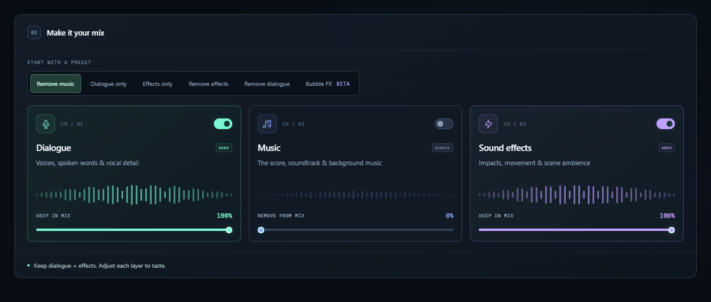
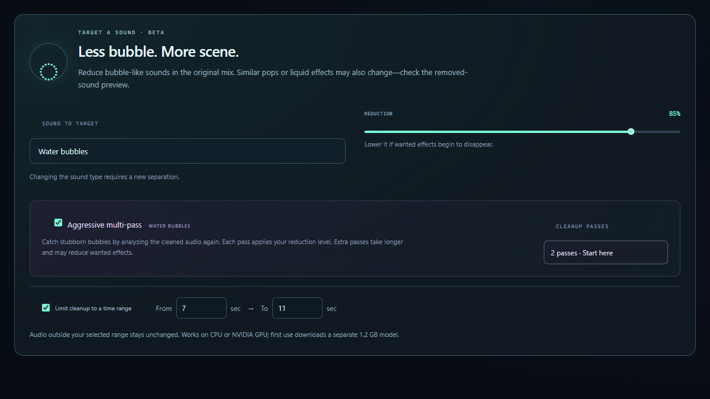
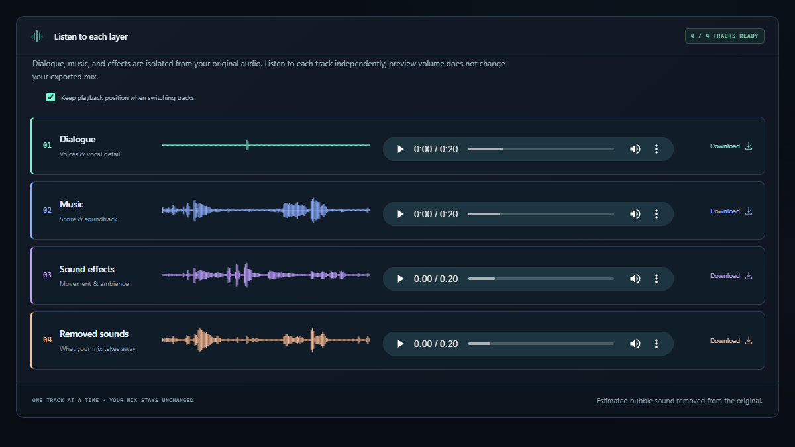

# SoundShredder

### Keep the shot. Clean the sound.

Remove unwanted dialogue, music and sound effects from your videos. 
Preview the result with your footage. Download the mix or each isolated track.

**Local processing · Windows & macOS · CPU & NVIDIA GPU**

  <a href="https://github.com/xD4O/SoundShredder/releases/download/v1.2.2-electron-windows-preview.1/SoundShredder-Electron-1.2.2-Windows-x64-Setup.exe"><strong>Download for Windows</strong></a>
  &nbsp; · &nbsp;
  <a href="#mac-browser-setup"><strong>Mac setup</strong></a>

[Install the desktop app](#install-the-desktop-app) · [Run in your browser](#run-the-web-app-locally) · [How it works](#from-clip-to-cleaned-audio) · [Guides](#guides-and-support)

Made by **cyr4x** for the **Higgsfield Community**.

The shared desktop and browser interface. Remove music, keep the scene, then adjust each layer.

## Your footage. Your soundtrack.

Built for Seedance, Genjutsu and other generations where the shot works but the audio needs cleaning. Drop in an MP4, MOV, MP3 or WAV directly; SoundShredder extracts the audio for you.

| Separate the layers | Target unwanted bubbles | See and hear the result |
| :--- | :--- | :--- |
| Keep or remove dialogue, music and effects. Remix without separating again. | Reduce bubble-like sounds with a selected time range and optional aggressive multi-pass. | Toggle the video monitor, audition individual tracks and export WAVs for your editor. |

Audio stays on your computer. Initial engine/model downloads need internet; cached processing works offline. No account or API key is required.

## Install the desktop app

**Recommended on Windows.** The Electron app includes Python and installs its audio engine automatically. You get the same interface in a dedicated window, with native menus, Save dialogs and saved sessions.

> [!WARNING]
> **Mac desktop downloads have a known Finder/Gatekeeper launch issue.** Users report “SoundShredder is damaged and can't be opened.” The published preview is not Developer ID signed or notarized. Use the [Mac browser setup](#mac-browser-setup) for now, or read the [Mac launch troubleshooting](electron/docs/MACOS.md#finder-says-damaged-or-cannot-be-opened) before trying the desktop preview. Changing from DMG to ZIP does not provide Apple trust.

| Platform | Download | Requirements |
| :--- | :--- | :--- |
| **Windows** | [EXE installer](https://github.com/xD4O/SoundShredder/releases/download/v1.2.2-electron-windows-preview.1/SoundShredder-Electron-1.2.2-Windows-x64-Setup.exe) | Windows 10/11 x64 · CPU or compatible NVIDIA GPU |
| **Mac · Apple Silicon** | [Desktop preview — launch issue](https://github.com/xD4O/SoundShredder/releases/tag/v1.2.0-electron-macos-preview.1) | macOS 13+ · M-series Mac · CPU |
| **Mac · Intel** | [Desktop preview — launch issue](https://github.com/xD4O/SoundShredder/releases/tag/v1.2.0-electron-macos-preview.1) | macOS 13+ · Intel Mac · CPU |

### Windows EXE

1. **Download the EXE** above. Quit an older SoundShredder standalone through its setup screen before installing.
2. **Run the installer.** Choose the app folder and finish setup. No separate Python installation, PATH changes or administrator rights are needed.
3. **Open SoundShredder** from Start or the desktop shortcut. Use **Choose folder…** to pick a drive for engines, models and sessions, or keep the current location.
4. **Choose CPU or NVIDIA GPU**, then select **Set up SoundShredder**. Keep internet connected for the initial downloads. The workspace opens when ready.

Allow **4 GiB free for CPU** or **14 GiB for NVIDIA** setup, plus the app, models and saved media. NVIDIA needs a compatible GPU and current driver; a separate CUDA Toolkit is not required.

**Choose your storage:** use **SoundShredder → Choose storage folder…** to change the location later. Your choice survives updates and reopening. Existing files stay in their original folder; select that folder again to return to its saved work. Keep external drives connected. [Storage guide](electron/docs/WINDOWS.md#choose-where-your-files-live).

**First setup:** watch live download progress, open Setup details, or use **Cancel setup**. Closing during setup offers **Cancel setup and quit**. Reopen and retry to repair an interrupted engine; saved sessions are kept. See the [setup recovery guide](electron/docs/WINDOWS.md#follow-or-cancel-first-setup).

**Uninstall:** quit the app, then choose **Uninstall SoundShredder** in Start or remove it through **Windows Settings → Apps**. Saved sessions and engines are kept. See the [Windows uninstall guide](electron/docs/WINDOWS.md#uninstall-the-windows-app) for full removal.

### macOS DMG

1. **Read the Mac launch notice above.** If testing the desktop preview, download the matching DMG from the [Mac release page](https://github.com/xD4O/SoundShredder/releases/tag/v1.2.0-electron-macos-preview.1). Check Apple menu → About This Mac: use Apple Silicon for M-series chips, or Intel for Intel processors.
2. **Quit any older standalone.** Open the DMG, drag **SoundShredder** into **Applications**, then eject the disk image.
3. **Open SoundShredder** from Applications and select **Set up SoundShredder**. The CPU engine downloads automatically. No Homebrew or separate Python is needed.

Allow **3 GiB free for setup**, plus the app, models and saved media. Mac processing currently uses CPU; Apple Metal/MPS is not enabled. ZIP alternatives are available on the [Mac release page](https://github.com/xD4O/SoundShredder/releases/tag/v1.2.0-electron-macos-preview.1).

> [!IMPORTANT]
> Desktop downloads are **unsigned previews**; Mac builds are not notarized. Windows/macOS may show a security prompt. Read the [Windows guide](electron/docs/WINDOWS.md) or [Mac guide](electron/docs/MACOS.md) for platform-specific installation and troubleshooting.

**Close and return:** finish or cancel setup/processing, then close the window or choose **SoundShredder → Quit SoundShredder**. Reopen the same shortcut or app to return to your saved sessions. Opening it twice brings the existing window forward.

## Run the web app locally

Prefer the interface in your browser? Use the Python source version. It runs on **your computer at localhost**; there is no hosted website to sign into.

**[Download the web app source ZIP](https://github.com/xD4O/SoundShredder/archive/refs/heads/main.zip)** → extract the entire ZIP into a writable folder such as Documents. Keep the extracted files together and follow your platform below.

### Windows browser setup

1. Install **Python 3.12** from [python.org](https://www.python.org/downloads/), with **Add Python to PATH** enabled.
2. In the extracted SoundShredder folder, run **Setup CPU.bat** for CPU, or **Setup NVIDIA GPU.bat** for a compatible NVIDIA GPU. Wait for installation to finish.
3. Double-click **Start SoundShredder.bat**. It opens the app in your browser, normally at **http://127.0.0.1:7860**.

Keep the launcher window open while using the web app. Close it or press **Ctrl+C** to stop the server; reopen the same Start file next time. Closing only the browser tab leaves the server running.

### Mac browser setup

1. Use **macOS 12+** and install **Python 3.11** with the [macOS universal2 installer](https://www.python.org/downloads/release/python-3119/). It works on Apple Silicon and Intel.
2. Open **Start SoundShredder.command** in the extracted folder. The first run installs the CPU dependencies and opens the browser interface.
3. Keep its Terminal window open. Press **Control+C** to stop; reopen the same launcher to return.

If Finder will not run the `.command` file, type `bash ` in Terminal, drag the launcher into that window, and press Return. For `CERTIFICATE_VERIFY_FAILED`, follow the [Mac source certificate repair guide](support/mac/README.md).

Both browser setups need internet for the first engine/model downloads. Run one server per session folder. For Linux or command-line use, see the [manual setup reference](docs/REFERENCE.md#manual-installation--other-operating-systems).

## From clip to cleaned audio

1. **Drop your video or audio.** No separate audio extraction is needed.
2. **Pick a preset.** Remove music, keep dialogue only, keep effects only, remove effects, remove dialogue, or target Bubble FX.
3. **Process and compare.** Toggle **Show video preview** and switch between the original, cleaned mix and available tracks.
4. **Download your result.** Save the cleaned WAV, individual tracks or a ZIP. Import the audio into your editor and mute the original soundtrack.

**Exports are audio, not a replacement MP4.** Inputs support up to **500 MB / 10 minutes / mono or stereo**. AI separation can affect wanted sounds too; audition the result before using it in your final edit.

### Stubborn bubbles, meet another pass

Choose **Bubble FX → Water bubbles**, enable **Aggressive multi-pass**, and start with **2 passes**. Try 3 or 4 for stronger cleanup. Limit the range when possible, such as **7–11 seconds**, and listen to **Removed sounds** to check what was taken away.

More passes take longer and may reduce similar effects. Bubble FX is experimental and currently uses preset sound descriptions; custom text prompting is not yet available.

### Every layer, its own track

Listen to **Dialogue**, **Music**, **Sound effects** and **Removed sounds** independently, with waveforms and individual WAV downloads. Keep playback positions linked to compare the same moment.

Normal separation prepares the tracks automatically. In a Bubble FX session, use **Prepare isolated tracks** to separate dialogue, music and effects from the original audio; the cleaned result stays intact.

## Sessions and updates

| Task | Where to go |
| :--- | :--- |
| Start a new session | **Audio separator** in the left panel. Completed sessions remain saved. |
| Reopen a result | Choose a filename under **Recent sessions**. |
| Delete a session | Use its **×** or **Delete this session**. Save wanted downloads elsewhere first. |
| Update Electron | **Help → Check for Electron updates**. Quit, install the newer EXE or replace the Mac app, then reopen. Sessions and compatible engines are retained. |
| Update the browser version | Download a fresh source ZIP. With both apps stopped, copy the old `data` folder into the new folder and run its launcher. Keep the old folder until checked. |

The sidebar **Check for updates** follows stable source releases; it does not announce Electron previews or every change on `main`. Desktop setup and diagnostics are under the **SoundShredder** application menu.

## Guides and support

- **[Illustrated community guide (PDF)](output/pdf/SoundShredder-Higgsfield-Community-Guide-v1.2.0.pdf)** · [Save the HTML guide](https://raw.githubusercontent.com/xD4O/SoundShredder/main/output/html/SoundShredder-Higgsfield-Community-Guide.html) and open it in a browser.
- **[Windows desktop help](electron/docs/WINDOWS.md)** · **[Mac desktop help](electron/docs/MACOS.md)** · [Mac source SSL repair](support/mac/README.md).
- [Detailed usage, CLI and model reference](docs/REFERENCE.md) · [Build Electron](electron/README.md) · [Tested behavior and limitations](VERIFICATION.md).
- [Report an issue](https://github.com/xD4O/SoundShredder/issues) · [Roadmap](ROADMAP.md) · [Release history](RELEASE_NOTES.md).

Layer separation uses [Bandit v2](https://github.com/kwatcharasupat/bandit-v2); targeted Bubble FX uses [AudioSep](https://github.com/Audio-AGI/AudioSep). Model weights download separately. See [model attribution and licenses](docs/REFERENCE.md#model-attribution) and [branding credits](static/BRANDING.md).

---

**Made by cyr4x · Made for the Higgsfield Community**

[X](https://x.com/_cyr4x) · [Higgsfield](https://higgsfield.ai/@cyr4x) · [Instagram](https://www.instagram.com/__cyr4x__/) · [YouTube](https://www.youtube.com/@cyr4xfilms)

Community-created. Not an official Higgsfield product. Screenshots show details of the shared interface.

