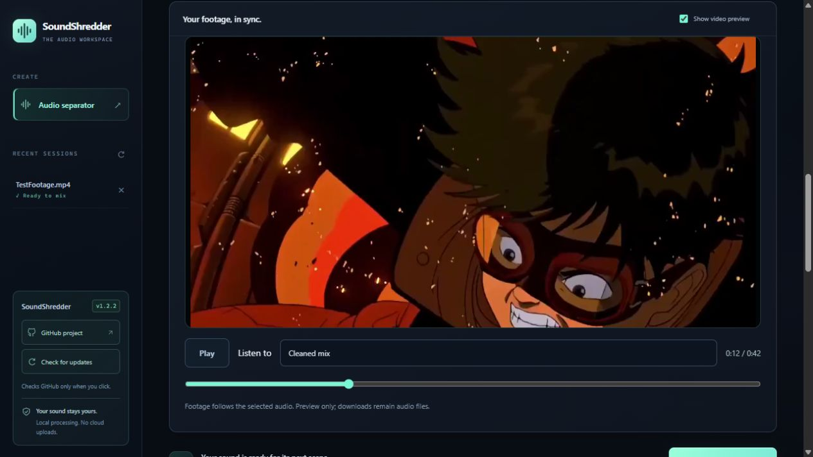
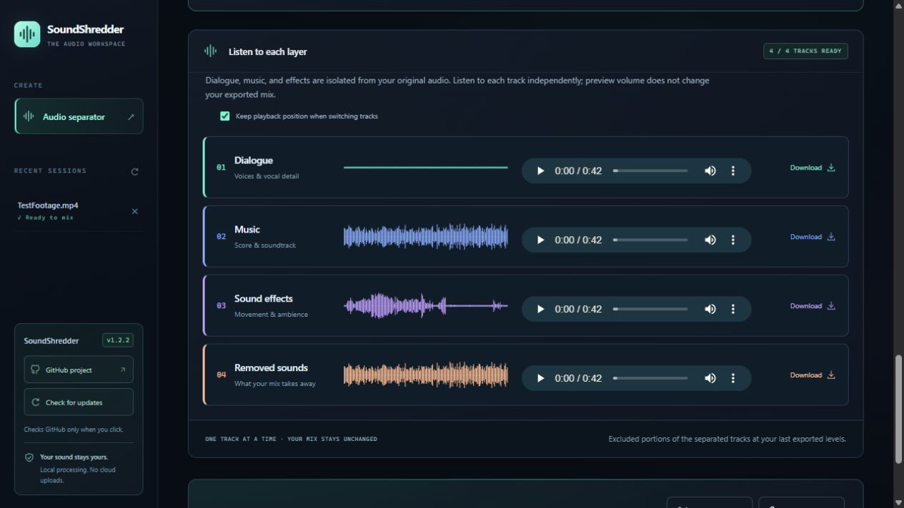

# Worked example: Akira footage

Use an existing video to separate its soundtrack, audition the layers against the picture, and export audio for your edit. This example uses the user-supplied **TestFootage.mp4** Akira clip. The screenshots come from a real SoundShredder 1.2.2 source-app session on September 22, 2026; Electron shares the same workspace.

## 1. Drop the video and choose what stays

Open SoundShredder and drag **TestFootage.mp4** into **Bring your audio**, or use **browse files**. No external audio extraction is needed. The supplied clip is approximately **43 seconds**, with **48 kHz stereo audio**.

Choose **Remove music**. Confirm **Dialogue 100%**, **Music 0%**, and **Sound effects 100%**. This asks the model to retain dialogue and effects while excluding the estimated music layer. Choose Auto, CPU or NVIDIA GPU, then **Separate audio**. On Mac, use CPU.

This example completed on a Windows RTX 5090 using Auto/CUDA. It is one local source-app run, not a benchmark or a claim about every GPU or packaged installer.

## 2. Watch while comparing the sound

Enable **Show video preview** and choose **Original**, then **Cleaned mix**, from **Listen to**. Seek to the same moment and compare. The screenshot shows **0:12**; that is a comparison position, not a detected problem region. Disable the checkbox whenever you prefer an audio-only workspace.

The video is muted internally and follows the selected audio. SoundShredder does not overwrite the original MP4 or export a replacement video.

## 3. Audition the four tracks

- **Dialogue:** the estimated voice layer. In this run its waveform is nearly flat; a quiet track is not necessarily an error.
- **Music:** the estimated score, which this preset excludes from the cleaned mix.
- **Sound effects:** the estimated scene effects and ambience.
- **Removed sounds:** the separated material excluded by the latest mix. With these settings, it corresponds to the excluded music layer.

Keep **Keep playback position when switching tracks** enabled to compare the same moment. Listen for wanted impacts, ambience or vocal details in Removed sounds. If needed, adjust the layer levels and select **Update mix**; this reuses the stems rather than running separation again. Preview volume/mute controls do not change the export.

## 4. Download and return to your editor

Use **Download cleaned WAV**, an individual track's **Download**, or **All tracks + mix (.zip)**. Align the WAV with the original clip's start in your editor and mute the original audio. The checked exports have **2,052,096 frames at 48,000 Hz (42.752 seconds), stereo**, matching the decoded source. Matching timing verifies alignment, not perceptual separation quality.

## 5. Keep the session or start fresh

Use **Audio separator** in the left panel to begin another session. Select **TestFootage.mp4** under **Recent sessions** to return. The sidebar **× deletes the session** after confirmation; it is not a close-tab control. Download important outputs before deleting. Quitting and reopening Electron retains completed sessions.

## When to use Bubble FX instead

This example demonstrates **music removal**. It does not establish that the Akira clip contains unwanted bubbles. For a different clip with that sound, use **Bubble FX > Water bubbles**, select the affected interval, and try **2-pass Aggressive multi-pass** before 3 or 4. More passes can reduce persistent remnants but can also affect similar wanted effects. Audition Removed sounds after every attempt. [Bubble cleanup reference](REFERENCE.md#bubble-fx-preset-experimental)

Only screenshots of the supplied example are included in the documentation; the source video and extracted soundtrack are not distributed with the project. Use your own footage to follow the same steps.
